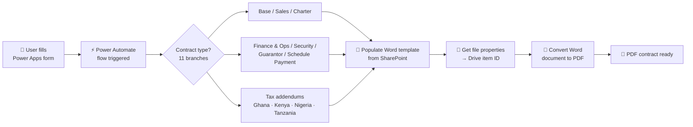
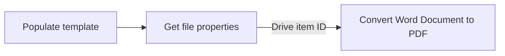

# 📄 Contract Automation Solution

> One Power Apps form, one Power Automate flow — the right contract generated from Word templates and delivered as a PDF.

---

## 🧩 Business problem

Contracts were prepared manually. Each one had to be put together by hand from the right template, which was **slow and error-prone** — especially with many contract types and country-specific tax addendums to choose from.

## 💡 Solution overview

- A **single Power Apps form** captures all contract details in one place.
- A **Power Automate flow** picks the right **Word template stored in SharePoint**, populates it and **converts it to PDF**.
- The flow covers **10+ contract types across 11 branches**:
  - Base · Sales · Charter · Finance & Operations · Security · Guarantor · Schedule Payment
  - Country tax addendums for **Ghana, Kenya, Nigeria and Tanzania**

## 🏗️ Workflow / architecture

## ✨ Key features

- One entry point (Power Apps form) for every contract type
- Template-driven generation — contract wording lives in Word templates in SharePoint, not in the flow
- Branch-per-contract-type flow design (11 branches) that is easy to extend
- Country-specific tax addendums for Ghana, Kenya, Nigeria and Tanzania
- Automatic PDF output

## 🔧 Technical challenge & fix

**Problem:** the **"Convert Word Document to PDF"** action failed in **all 11 branches**.

**Root cause:** the action's *File* field was pointing to a **SharePoint item ID/path**, but the action expects the **Microsoft Graph drive item ID**.

**Fix:** added a branch-scoped **"Get file properties"** step and passed its **"Drive item ID"** output into the Convert action's *File* field.

## 👩‍💼 My role

- Designed and built the Power Apps form and the Power Automate flow
- Set up the Word templates in SharePoint and the branch logic for each contract type
- Diagnosed and fixed the PDF conversion failure across all branches

## 📈 Outcomes

- ✅ Removed manual document preparation
- ✅ Reduced errors in contract preparation

## 🖼️ Screenshots

> _Screenshots coming soon._ Client details will be removed or blurred.

| Power Apps form | Flow branches | Generated PDF |
|---|---|---|
| _placeholder_ | _placeholder_ | _placeholder_ |

## 🧠 Key learnings

- Power Automate file actions don't all accept the same file identifier — check whether an action wants a SharePoint path/item ID or a Graph **drive item ID**.
- Keeping each branch self-contained (its own "Get file properties" step) makes large multi-branch flows easier to debug.
- Keeping contract wording in Word templates lets the business update contracts without changing the flow.

---

Built by [Mubeena M E](https://github.com/mubeename) · [LinkedIn](https://www.linkedin.com/in/mubeename)
